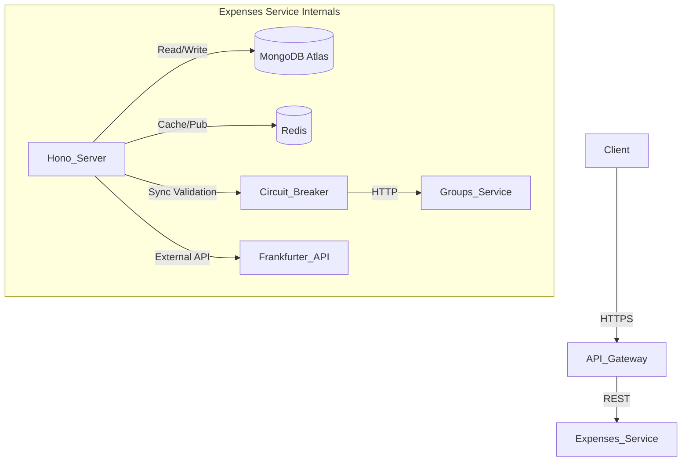

# 💸 0debt - Expenses Service

> **The financial heart of the 0debt ecosystem.**

This microservice is responsible for expense management, currency conversion, and the complex algorithmic logic to calculate debts and simplify payments within groups.

Built with **Bun** and **Hono**, it is designed to be high-performance, resilient, and scalable, implementing advanced distributed system patterns to achieve robust consistency.

---

## 🚀 Key Features

### Core Business Logic
* **Expense Tracking:** Full CRUD operations for shared expenses with support for multiple split types (Equal, Exact, Percentage).
* **Settlements:** Record payments between users to settle debts and update balances automatically.
* **Debt Simplification Algorithm:** Implements a greedy algorithm to minimize the number of transactions required to settle up debts within a group.
* **Currency Conversion:** Automatically converts expenses paid in foreign currencies (USD, GBP, JPY) to the group's base currency (EUR) using the **Frankfurter API**.

### Architecture & Resilience (Grade 10 Features)
* **🛡️ Circuit Breaker:** Implemented via `opossum` to protect the system when the synchronous dependency `groups-service` is down.
* **⚡ Redis Caching:** Caches calculated balances to reduce CPU load on high-traffic groups, with automatic invalidation on new expenses.
* **📊 Materialized Views:** Uses MongoDB atomic operators (`$inc`) to maintain real-time pre-calculated statistics for the Analytics Service, ensuring $O(1)$ read performance.
* **📢 Event-Driven:** Publishes events (`expense.created`, `expense.deleted`, `settlement.created`) to Redis Pub/Sub to trigger asynchronous notifications.
* **🔗 Saga Pattern Participant:** Exposes endpoints to validate user deletability, ensuring data integrity across the distributed system.

---

## 🛠️ Tech Stack

* **Runtime:** [Bun](https://bun.sh) (v1.x)
* **Framework:** [Hono](https://hono.dev) (OpenAPI-based)
* **Database:** MongoDB Atlas (Mongoose ODM)
* **Caching & Messaging:** Redis
* **Validation:** Zod (Automatic Swagger generation)
* **Testing:** Bun Test Runner
* **Resilience:** Opossum (Circuit Breaker)

---

## 🔌 Architecture Overview



---

## ⚙️ Environment Variables

Create a `.env` file in the root directory:

```env
# Server
PORT=3000
NODE_ENV=development

# Database
MONGO_URI=mongodb+srv://<user>:<password>@cluster0.mongodb.net/expenses-db

# Redis (Cache & Pub/Sub)
REDIS_URL=redis://localhost:6379

# Internal Microservices Links
GROUPS_SERVICE_URL=http://localhost:3001
```

---

## 📦 Installation & Running

### 1. Local Development

```bash
# Install dependencies
bun install

# Run in development mode (Hot reload)
bun run dev
```

### 2. Docker (Production)

```bash
# Build the image
docker build -t expenses-service .

# Run the container
docker run -p 3000:3000 --env-file .env expenses-service
```

### 3. Running Tests

We use **Bun Test** for unit and integration testing, covering the debt algorithm and materialized view logic.

```bash
bun test
```

---

## 📖 API Documentation (OpenAPI / Swagger)

This service uses `@hono/zod-openapi` to generate documentation automatically.

* **UI Interface:** `http://localhost:3000/ui`
* **JSON Spec:** `http://localhost:3000/doc`

---

## 🔗 API Endpoints

### Health Check

| Method | Path | Description |
| :--- | :--- | :--- |
| `GET` | `/health` | Service health check for Coolify/K8s |

### Expenses (CRUD)

| Method | Path | Description | Access |
| :--- | :--- | :--- | :--- |
| `POST` | `/api/v1/expenses` | Create a new expense | **User** |
| `GET` | `/api/v1/expenses/{id}` | Get a specific expense by ID | **User** |
| `PUT` | `/api/v1/expenses/{id}` | Update an existing expense | **User** |
| `DELETE` | `/api/v1/expenses/{id}` | Delete an expense | **User** |
| `GET` | `/api/v1/expenses/groups/{groupId}` | List all expenses for a group | **User** |

### Balances

| Method | Path | Description | Access |
| :--- | :--- | :--- | :--- |
| `GET` | `/api/v1/balances/{groupId}` | Calculate debts and generate payment plan (Cached 60s) | **User** |

### Settlements

| Method | Path | Description | Access |
| :--- | :--- | :--- | :--- |
| `POST` | `/api/v1/settlements` | Record a payment between users | **User** |

### Internal (Microservice Communication)

| Method | Path | Description | Access |
| :--- | :--- | :--- | :--- |
| `GET` | `/api/v1/internal/stats/{groupId}` | Get aggregated stats from Materialized View | **Internal** (Analytics) |
| `GET` | `/api/v1/internal/users/{userId}/debtStatus` | Check if user has pending debts (Saga Pattern) | **Internal** (Users) |

---

## 📝 Endpoint Details

### POST `/api/v1/expenses`

Creates a new expense with automatic currency conversion.

**Request Body:**
```json
{
  "groupId": "viaje_usa_2025",
  "description": "Dinner at Italian restaurant",
  "totalAmount": 85.50,
  "currency": "EUR",
  "category": "FOOD",
  "splitType": "EQUAL",
  "payerId": "user-123",
  "shares": [
    { "userId": "user-123", "amount": 21.38 },
    { "userId": "user-456", "amount": 21.38 },
    { "userId": "user-789", "amount": 21.38 },
    { "userId": "user-012", "amount": 21.36 }
  ]
}
```

**Categories:** `FOOD`, `TRANSPORT`, `ACCOMMODATION`, `ENTERTAINMENT`, `OTHER`

**Split Types:** `EQUAL`, `EXACT`, `PERCENTAGE`

**Currencies:** `EUR`, `USD`, `GBP`, `JPY`

**Response (201):**
```json
{
  "status": "ok",
  "message": "Created",
  "data": {
    "_id": "6789abc...",
    "description": "Dinner at Italian restaurant",
    "totalAmount": 85.50,
    "originalAmount": 85.50,
    "currency": "EUR",
    "exchangeRate": 1,
    ...
  }
}
```

**Side Effects:**
- Invalidates Redis cache for group balances
- Updates Materialized View (GroupStats)
- Publishes `expense.created` event to Redis Pub/Sub

---

### GET `/api/v1/expenses/{id}`

Retrieves a specific expense by its ID.

**Response (200):**
```json
{
  "status": "ok",
  "data": {
    "_id": "6789abc...",
    "description": "Dinner at Italian restaurant",
    "totalAmount": 85.50,
    "originalAmount": 85.50,
    "currency": "EUR",
    "exchangeRate": 1,
    "date": "2024-12-08T20:30:00.000Z",
    "payerId": "user-123",
    "groupId": "viaje_usa_2025",
    "splitType": "EQUAL",
    "category": "FOOD",
    "shares": [...],
    "isSettlement": false,
    "createdAt": "2024-12-08T20:35:00.000Z",
    "updatedAt": "2024-12-08T20:35:00.000Z"
  }
}
```

---

### PUT `/api/v1/expenses/{id}`

Updates an existing expense. If amount or currency changes, recalculates conversion.

**Request Body:**
```json
{
  "description": "Updated dinner description",
  "totalAmount": 90.00,
  "currency": "EUR",
  "category": "FOOD",
  "splitType": "EQUAL",
  "payerId": "user-123",
  "shares": [...]
}
```

**Side Effects:**
- Recalculates currency conversion if amount/currency changed
- Updates Materialized View (reverts old values, applies new)
- Invalidates Redis cache

---

### DELETE `/api/v1/expenses/{id}`

Deletes an expense and updates all related statistics.

**Response (200):**
```json
{
  "status": "ok",
  "message": "Expense deleted successfully",
  "deletedId": "6789abc..."
}
```

**Side Effects:**
- Updates Materialized View (decrements totals)
- Invalidates Redis cache
- Publishes `expense.deleted` event

---

### GET `/api/v1/balances/{groupId}`

Calculates net balances for all group members and generates optimized payment suggestions.

**Response (200):**
```json
{
  "status": "ok",
  "data": {
    "balances": {
      "user-123": 176.84,
      "user-456": -40.16,
      "user-789": -61.18,
      "user-012": -75.50
    },
    "payments": [
      { "from": "user-012", "to": "user-123", "amount": 75.50 },
      { "from": "user-789", "to": "user-123", "amount": 61.18 },
      { "from": "user-456", "to": "user-123", "amount": 40.16 }
    ]
  },
  "source": "database"
}
```

**Notes:**
- Positive balance = user is owed money (creditor)
- Negative balance = user owes money (debtor)
- Results are cached in Redis for 60 seconds
- `source` field indicates if response came from cache or database

---

### POST `/api/v1/settlements`

Records a payment between two users to settle a debt.

**Request Body:**
```json
{
  "groupId": "viaje_usa_2025",
  "fromUserId": "user-012",
  "toUserId": "user-123",
  "amount": 75.50
}
```

**Response (201):**
```json
{
  "status": "ok",
  "message": "Settlement recorded successfully",
  "data": {
    "settlementId": "6789xyz...",
    "groupId": "viaje_usa_2025",
    "fromUserId": "user-012",
    "toUserId": "user-123",
    "amount": 75.50
  }
}
```

**Side Effects:**
- Creates a special expense with `isSettlement: true`
- Invalidates Redis cache for group balances
- Publishes `settlement.created` event

---

### GET `/api/v1/internal/stats/{groupId}`

Returns pre-calculated statistics from the Materialized View.

**Response (200):**
```json
{
  "status": "ok",
  "data": {
    "totalSpent": 468.80,
    "expenseCount": 5,
    "categoryBreakdown": {
      "FOOD": 147.80,
      "TRANSPORT": 45.00,
      "ACCOMMODATION": 240.00,
      "ENTERTAINMENT": 36.00
    },
    "lastUpdated": "2024-12-08T21:00:00.000Z"
  }
}
```

---

### GET `/api/v1/internal/users/{userId}/debtStatus`

Checks if a user can be safely deleted (Saga Pattern participant).

**Response (200):**
```json
{
  "status": "ok",
  "data": {
    "userId": "user-123",
    "canDelete": false,
    "hasPendingDebts": true
  }
}
```

---

## 🧠 Advanced Implementation Details

### 1. The Debt Simplification Algorithm

Instead of forcing every user to pay every other user they owe, the service calculates the **net balance** of each participant. It then matches the biggest debtors with the biggest creditors to minimize the total number of transactions required to settle the group.

```typescript
// Simplified logic
function generatePayments(balances: Record<string, number>) {
  const debtors = []; // negative balances
  const creditors = []; // positive balances
  
  // Match biggest debtor with biggest creditor
  // Until all debts are settled
}
```

### 2. Resilience Strategy (Circuit Breaker)

Before creating an expense, we verify if the `payerId` belongs to the `groupId`.

* **Normal State:** Calls `groups-service` to validate.
* **Failure State:** If `groups-service` fails repeatedly (50% error rate), the **Circuit Breaker opens**.
* **Fallback:** The system enters a "degraded mode" (Simulated Validation) to allow the user to continue creating expenses, ensuring availability over strict consistency during outages.

### 3. Business Logic Limits

To comply with the monetization strategy:

| Plan | Limit |
| :--- | :--- |
| **FREE** | 50 expenses per group |
| **PRO** | Unlimited expenses |

*Implementation:* The service reads the `X-User-Plan` header injected by the API Gateway.

### 4. Event Publishing

The service publishes events to Redis Pub/Sub channel `events`:

| Event | Trigger |
| :--- | :--- |
| `expense.created` | New expense created |
| `expense.deleted` | Expense deleted |
| `settlement.created` | Settlement recorded |

---

## 📊 Data Models

### Expense Schema

```typescript
{
  _id: ObjectId,
  description: string,
  totalAmount: number,        // Converted to EUR
  originalAmount: number,     // Original amount before conversion
  currency: string,           // Original currency
  exchangeRate: number,       // Conversion rate used
  date: Date,
  payerId: string,
  groupId: string,
  splitType: 'EQUAL' | 'EXACT' | 'PERCENTAGE',
  category: 'FOOD' | 'TRANSPORT' | 'ACCOMMODATION' | 'ENTERTAINMENT' | 'OTHER',
  shares: [{ userId: string, amount: number }],
  isSettlement: boolean,      // true for settlement records
  createdAt: Date,
  updatedAt: Date
}
```

### GroupStats Schema (Materialized View)

```typescript
{
  groupId: string,
  totalSpent: number,
  expenseCount: number,
  categoryBreakdown: {
    FOOD: number,
    TRANSPORT: number,
    ...
  },
  lastUpdated: Date
}
```

---

## 🤝 Contribution

1. Fork the repository.
2. Create your feature branch (`git checkout -b feature/amazing-feature`).
3. Commit your changes (`git commit -m 'Add some amazing feature'`).
4. Push to the branch (`git push origin feature/amazing-feature`).
5. Open a Pull Request.

---

## 📄 License

This project is part of the **0debt** ecosystem, developed for the Distributed Systems course.

**Team:** Pareja 3 - Paloma y Paco